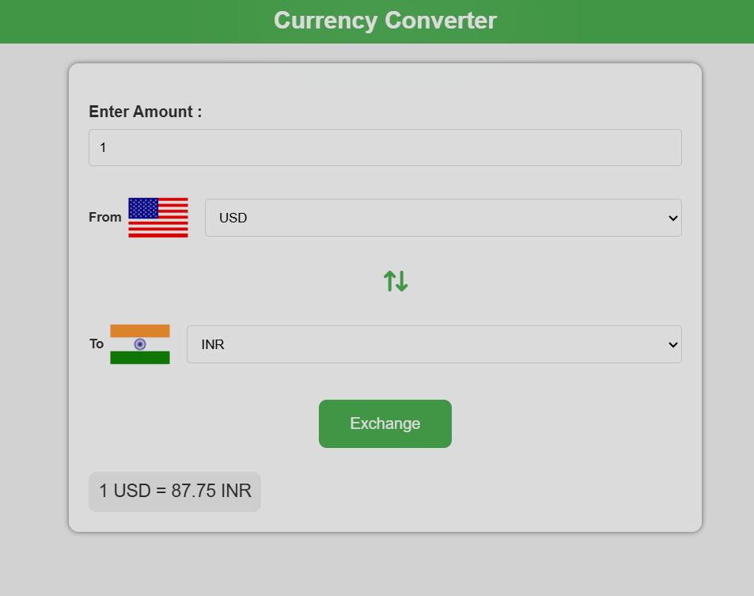

# currency-converter



A simple web application to convert currencies and display exchange rates using a free API. The application also displays the flags of the selected currencies and a graph of historical exchange rates.

## Features

- Convert between different currencies
- Display flags of the selected currencies
- Show historical exchange rates in a graph
- Swap currencies with a single click

## Technologies Used

- HTML
- CSS
- JavaScript
- ExchangeRate-API for fetching exchange rates

## Getting Started

### Prerequisites

- A modern web browser
- A free API key from [ExchangeRate-API](https://www.exchangerate-api.com/)

### Installation

1. Clone the repository:
    ```sh
    git clone https://github.com/YOUR_USERNAME/currency-converter.git
    ```
2. Navigate to the project directory:
    ```sh
    cd currency-converter
    ```
3. Open `index.html` in your web browser.

### Usage

1. Select the currencies you want to convert from and to.
2. Enter the amount you want to convert.
3. Click the "Convert" button to see the converted amount and the exchange rate.
4. The flags of the selected currencies will be displayed.
5. A graph of historical exchange rates will be shown below the conversion result.

   ##Live Link : https://sudhirskp.github.io/currency-converter/
